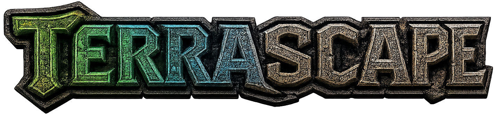

# Synthborn: Terrascape



Synthborn: Terrascape turns a live Hytale server world into an interactive 3D map you
explore in a web browser — terrain, mobs, players, and the day/night cycle, streamed
straight from the running server. It installs as a server-side mod and serves the
viewer over HTTP; players just open a link.

**Who this is for:**

- **Map viewers** — someone gave you a link to their Terrascape map. Go to
  [Using the map viewer](#using-the-map-viewer).
- **Server owners / admins** — you want to run Terrascape on your server. Start at
  [Installation](#installation), then the
  [Operations Manual](docs/operations-manual.md) for the full server + configuration
  guide.

---

## Features

- **Live 3D world** — the server meshes terrain chunks into 3D and streams them to the
  browser as you move, so the map reflects the real world state.
- **Mobs & players** — live mob cards (name, HP, ATK, stack count) and player markers,
  with an online-players sidebar.
- **Follow & first-person views** — focus, follow, or see through a player's eyes.
- **Day/night cycle** — a sky ribbon shows world time; optional time-based lighting.
- **Map-tile backdrop** — top-down 2D tiles fill in the distance beyond the 3D meshes.
- **Tunable rendering** — mesh distance, shading, water mode, fog, cosmetic detail, and
  loading budgets — all adjustable live from the settings panel.
- **Shareable links** — open access, or token-gated links you hand out per player.

---

## Using the map viewer

### Opening the map

- Open the map URL your server admin gives you (e.g. `http://your-server:5960`).
- If the map is **token-gated**, your link includes a one-time key
  (`…?key=abc123`). Opening it sets a session cookie and tidies the key out of the
  address bar. If your session later expires, a **"map access expired"** overlay
  appears — ask an admin (or run `/terrascape maplink` in-game if you have access) for
  a fresh link.

### Getting around (flight camera)

By default you fly freely around the world.

| Input | Action |
| --- | --- |
| `W` / `S` | Move forward / back |
| `A` or `Q` / `D` or `E` | Strafe left / right |
| `Space` / `R` / `PageUp` | Move up |
| `C` / `PageDown` | Move down |
| `Shift` (hold) | Sprint (faster movement) |
| Drag with the mouse | Look around |
| Mouse wheel | Zoom the view in / out |
| `Esc` | Close the settings panel |

### Following players

In the **Players** list (right side), each player has quick actions:

- **Click the tile** — fly the camera to that player.
- **Eye view** — see the world through that player's eyes (first-person).
- **Follow** — trail the player from an isometric camera.

### Settings panel

Click the gear icon (top-right) to open the panel. Controls are grouped into
collapsible **World**, **Render**, and **Experimental** sections. A few live in the
titlebar: **Mobs** and **Mob Blocks** toggles, the **mob update rate**, and **Sync Time**
(use world time for lighting).

**World**
- **World** — pick which world to view (switching reloads terrain and markers).
- **Voxel Mesh Distance** — radius of 3D terrain loaded around you (0–12).
- **Players / Auto / Bounds / Mob Blocks** — show player markers, auto-stream terrain
  around the camera, show chunk-load boundaries, show mob headshot blocks on the ground.
- **Clear mesh cache** — drop the browser's stored terrain/tiles (IndexedDB).

**Render**
- **Map Tiles** — show the flat 2D map backdrop, with distance and concurrent-load
  sliders.
- **Shade** — ambient-occlusion shading, with size and darkness, plus tree shade.
- **Land motion** — animate chunks rising in as they load.
- **Water** — Solid / Transparent / Hidden.
- **Cosmetic Blocks** (Off / Baked / Split) and **Visual Detail** (Basic / Struct /
  Foliage) — how much decorative geometry and shape detail to load.

**Experimental**
- **Fog** — enable distance fog with near/far/strength/haze sliders.
- **Loading budgets** — chunk download concurrency, meshes added per frame, and a
  per-frame mesh time budget for smoother loading on slower machines.

### Reading the map

- **Sky ribbon** (top center) shows the current world time and phase.
- **Render Details** card (bottom right) shows status, loaded chunks/meshes, mob count,
  and live camera position / chunk coordinates. Click its header to collapse it.

---

## Installation

> Terrascape is a **dedicated-server mod**, not a client mod. Installing it makes the
> web map available; players only need a browser and a link.

### Quickstart: local server from CurseForge

<!-- TODO: replace with the real CurseForge project URL/slug once published. -->

Use this path when you downloaded Terrascape from CurseForge and want the minimum local
server setup.

1. Download the latest `Terrascape-<version>.jar` from the CurseForge page.
2. Stop your Hytale dedicated server.
3. Copy the jar into your server save's `mods/` folder:

   ```text
   <save>/mods/Terrascape-<version>.jar
   ```

4. Start the server once. Terrascape creates its config folder and defaults under:

   ```text
   <save>/mods/com.codelabchaos_Terrascape/
   ```

5. Open the local map in a browser on the same machine:

   ```text
   http://127.0.0.1:5960
   ```

By default, the map is local-only (`http.host=127.0.0.1`), public to anyone on that
machine (`access.mode=public`), and standalone RCON is off (`rcon.enabled=false`).
You do not need the RCON port for normal map viewing.

To let another computer open the map, edit
`<save>/mods/com.codelabchaos_Terrascape/terrascape.properties`, then restart:

```properties
http.host=0.0.0.0
http.port=5960
```

Then open `http://<server-host>:5960` from the other computer and make sure your firewall
allows the web port. To avoid exposing a numeric IP in generated map links, also set:

```properties
access.publicBaseUrl=http://map.example.com:5960
```

For token-gated links, set `access.mode=restricted`, restart, and have players with
`terrascape.map.use` run `/terrascape maplink` in-game.

### Manual install

1. Get the jar — download a release, or build it yourself with `./gradlew build`
   (output: `build/libs/Terrascape-<version>.jar`).
2. Copy the jar into your Hytale save's `mods/` folder.
3. Start the server once to generate `terrascape.properties` in the plugin data folder.
4. (Optional) edit `terrascape.properties` — most commonly `http.host` and `http.port`.
5. Open `http://<server-host>:5960` in a browser.

For CORS, TLS/reverse proxies, permissions, access tokens, RCON, cache clearing, and the
full configuration reference, see the [Operations Manual](docs/operations-manual.md).

---

## For server admins

The [Operations Manual](docs/operations-manual.md) is the complete server runbook:

- Build, deploy, and server lifecycle (`tools/deploy.js`, targets, RCON)
- Making the map public (bind address, ports, CORS, TLS)
- Access control & map tokens
- The configuration reference and the running-server file layout
- Performance suites and troubleshooting

The manual also covers the `/terrascape` command surface, permissions and token
scopes, the full configuration reference (keys, env overrides), and the
running-server file layout.

---

## Development

For contributors working on the plugin or the viewer.

### Project layout

```
src/main/java/com/codelabchaos/terrascape/   Plugin: HTTP server, terrain mesher, commands, config
  ├─ terrain/                                 Chunk sampling, meshing, glTF writing
  ├─ web/                                      Embedded HTTP endpoints + DTOs
  ├─ commands/                                 /terrascape admin command
  └─ config/                                   terrascape.properties loading
src/main/resources/
  ├─ manifest.json                            Hytale plugin manifest
  └─ web/                                       Static shell served from the jar (index.html, styles.css, textures)
      └─ dist/terrascape.js                    Webpack bundle (generated; gitignored)
web/src/                                        TypeScript viewer sources (entry: app.ts)
```

The browser client is organized by concern: `common/` (pure logic, unit-tested),
`scene/` (Three.js), `terrain/`, `tile-map/`, `entities/`, `camera/`, `ui/`,
`platform/`, `library/`.

### Build

```sh
./gradlew build
```

Compiles the Java plugin and runs `npm run build:web` (webpack) via the `buildWeb` task,
bundling the viewer into `web/dist/terrascape.js` before packaging it into the jar. The
bundle is a generated artifact (gitignored); rebuild it with `npm run build:web`.

### CI and releases

GitHub Actions runs the Java and web unit suites and builds the jar from a clean checkout
for every pull request and push to `main`. You can also run **Build Terrascape** manually;
manual runs retain `terrascape-build-<commit-sha>` for 30 days. This is an ordinary build
artifact and is never uploaded to CurseForge automatically.

Releases are built only from version tags by
`.github/workflows/release-candidate.yml`. The tag without its leading `v` must match the
versions in `build.gradle.kts`, `package.json`, and `src/main/resources/manifest.json`.
For example, after merging the intended release commit, push `v0.1.0`. Actions tests the
tagged source, builds and inspects `Terrascape-0.1.0.jar`, records its checksum and source
commit, and publishes a GitHub Release containing the jar, `SHA256SUMS`, and build
evidence. Tags with a suffix, such as `v0.2.0-beta.1`, become GitHub prereleases. The
workflow also retains an Actions artifact as a short-term convenience, but the GitHub
Release assets are the canonical files used for hosted validation and CurseForge
publishing.

CurseForge publishing is a separate, manually dispatched workflow. It downloads a named
GitHub Release, verifies its recorded tag and jar checksum, reuses its generated release
notes, and uploads that same jar without rebuilding it. Repository maintainers should
configure the `curseforge` GitHub environment with required reviewers, the
`CURSEFORGE_API_TOKEN` environment secret, and the numeric `CURSEFORGE_PROJECT_ID`
environment variable. See the Operations Manual for the complete setup and publishing
procedure.

### Test

```sh
npm test                     # both unit tiers (Java + web)
npm run test:java            # Java unit tests (Gradle)
npm run test:web             # web unit tests (compile + run common/ modules)
npm run test:unit            # both tiers with coverage (alias for `npm run coverage`)
npm run testlive             # build the bundle, then Playwright against the viewer
npm run test:release         # both unit tiers + the live Playwright suite
```

See [`tests/README.md`](tests/README.md) for the three test tiers, and the
[Operations Manual](docs/operations-manual.md#performance) for the perf suites.

### Tools

| Tool | Purpose | Usage |
|------|---------|-------|
| `tools/deploy.js` | Build/deploy/restart/verify the server (see ops manual). | `npm run deploy` |
| `tools/probe-blocks.js` | Query the worldview probe around a coordinate. | `node tools/probe-blocks.js --world default --at -1370 131 -1213` |
| `tools/parse-client-log.js` | Summarize client telemetry from a log file. | `node tools/parse-client-log.js <log-path>` |
| `tools/sample-mob-feed.js` | Capture sample entity-feed payloads for fixtures. | `node tools/sample-mob-feed.js` |
| `tools/run-terrascape-perf.js` | Run terrain/render performance suites. | `npm run perf` (`perf:dry`, `perf:smoke`, `perf:extensive`, …) |

---

## Reference docs

- [Operations Manual](docs/operations-manual.md) — the complete server, configuration,
  permissions, and access guide.
- [Sprint Board](docs/terrascape-sprint-board.md#mvp-release-review) — release checklist,
  validation environment rule, and release evidence template.

Shared Synthborn/Hytale reference material lives in
[`../synthborn-basecamp/docs/`](../synthborn-basecamp/docs/README.md); generated lookup
data (SDK signatures, labels, recipes/loot, prefab indexes) starts at
[`../synthborn-basecamp/docs/refs/`](../synthborn-basecamp/docs/refs/README.md).
