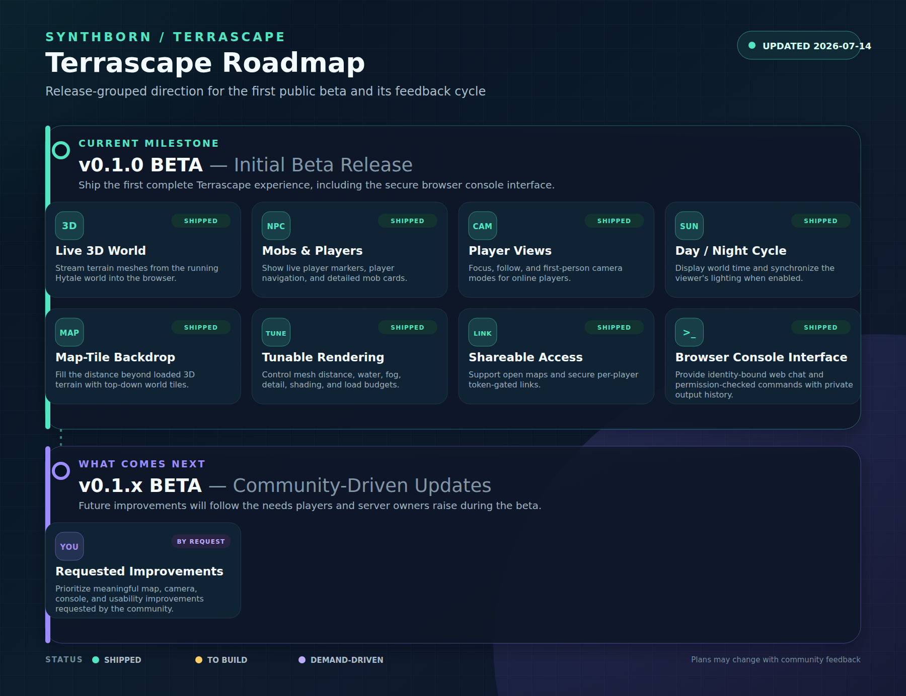

# Synthborn: Terrascape Roadmap

Release-grouped direction for the first public beta and its feedback cycle

## v0.1.0 BETA — Initial Beta Release

**CURRENT MILESTONE**

Ship the first complete Terrascape experience, including the secure browser console interface.

- **Live 3D World** — Stream terrain meshes from the running Hytale world into the browser. _✅ Shipped_
- **Mobs & Players** — Show live player markers, player navigation, and detailed mob cards. _✅ Shipped_
- **Player Views** — Focus, follow, and first-person camera modes for online players. _✅ Shipped_
- **Day / Night Cycle** — Display world time and synchronize the viewer's lighting when enabled. _✅ Shipped_
- **Map-Tile Backdrop** — Fill the distance beyond loaded 3D terrain with top-down world tiles. _✅ Shipped_
- **Tunable Rendering** — Control mesh distance, water, fog, detail, shading, and load budgets. _✅ Shipped_
- **Shareable Access** — Support open maps and secure per-player token-gated links. _✅ Shipped_
- **Browser Console Interface** — Provide identity-bound web chat and permission-checked commands with private output history. _✅ Shipped_

## v0.1.x BETA — Community-Driven Updates

**WHAT COMES NEXT**

Future improvements will follow the needs players and server owners raise during the beta.

- **Requested Improvements** — Prioritize meaningful map, camera, console, and usability improvements requested by the community. _◆ Demand-driven_

---

Plans may change as the beta community tells us what matters most.
